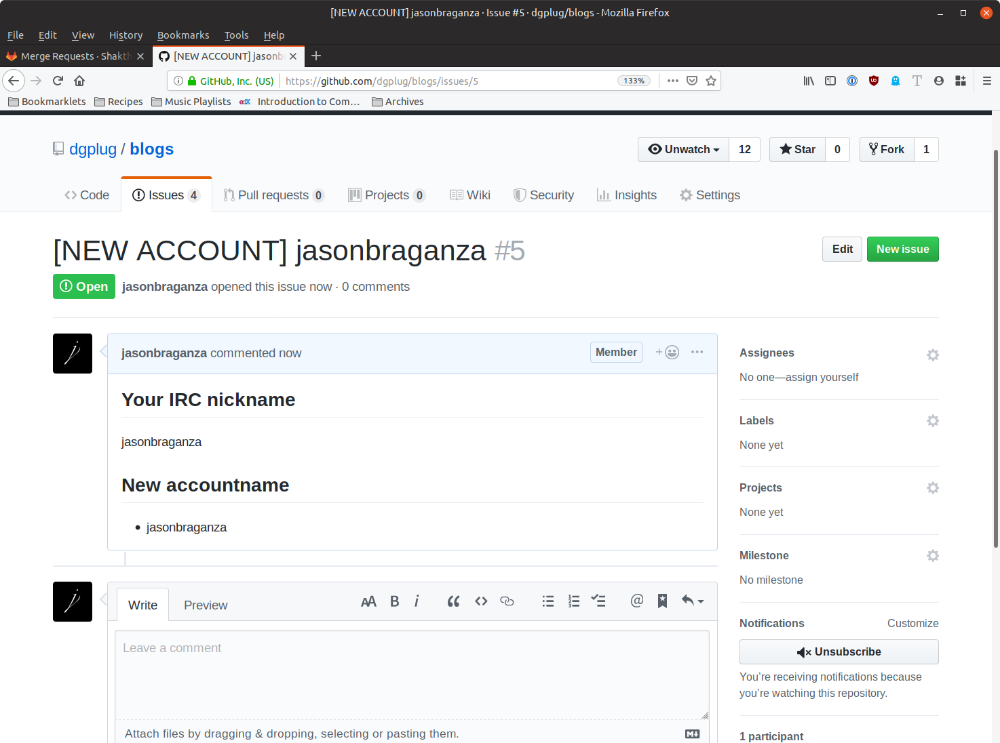

# Create a new issue if you want to have an account in https://blogs.dgplug.org/read

An admin will see your request and either create or deny or ask you for more details for your request.  

Example:
To create an issue,  
1. Click `New Issue`  
2. Click `Get Started` on the next page  
3. In the `title` of the issue replace the whole `{Write …}` section with your username. (as in the username you want at https://blogs.dgplug.org)  
4. Come down to the main section and enter your irc username below the ## Your IRC nickname title  
5. Enter the accountname you want, *again* under the ## New accountname section.  
6. Click Submit New Issue.   

---   

### Creating an Issue  
  

---  

### Issue Created  
  

---  
